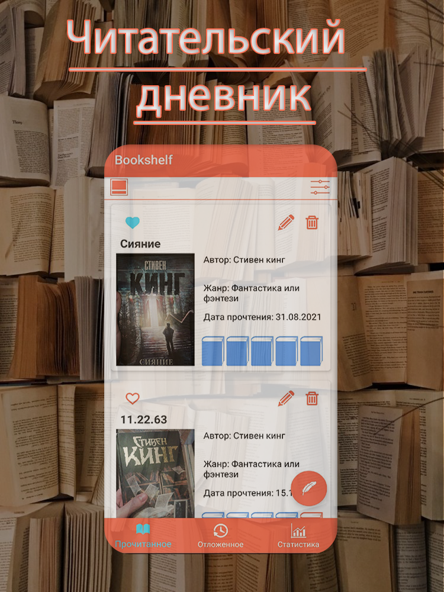
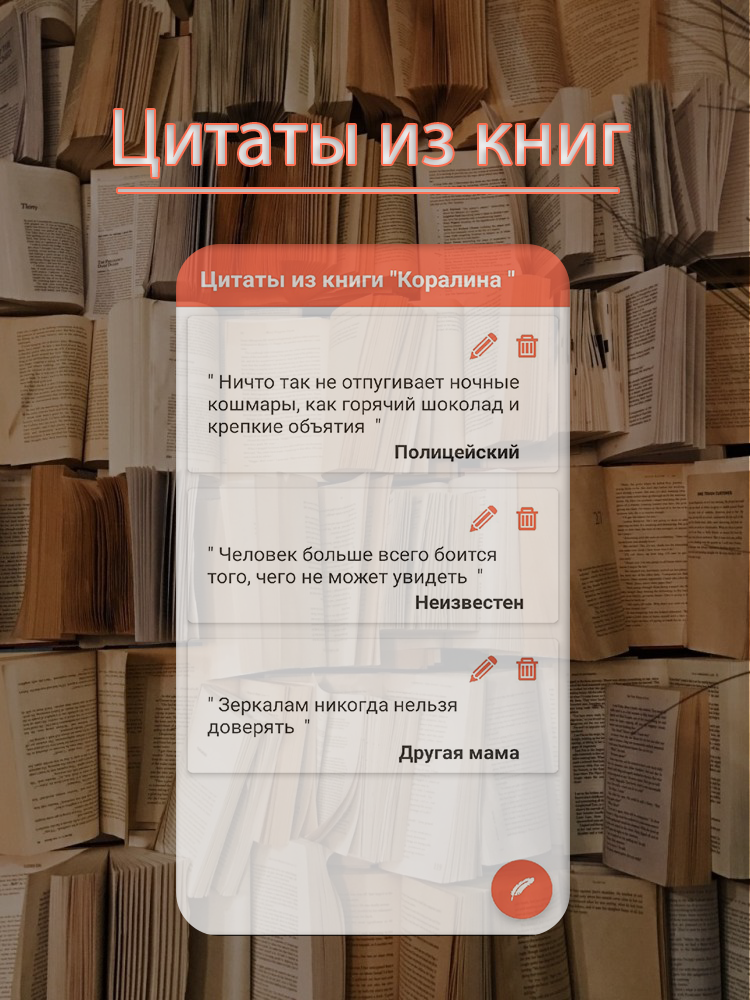

# Bookshelf

# Версия
> 2.0

# Требования: 
> Андройд 5.0 и выше

# Стек технологий:
> Xamarin.Android
> SQLite3
> Microcharts

# Описание:
Приложение представляет собой электронный читательский дневник, с помощью данного приложения вы можете контролировать сколько вы прочитали, сколько планируете. Так же вы имеете возможность хранить цитаты из любимых вами книг.

